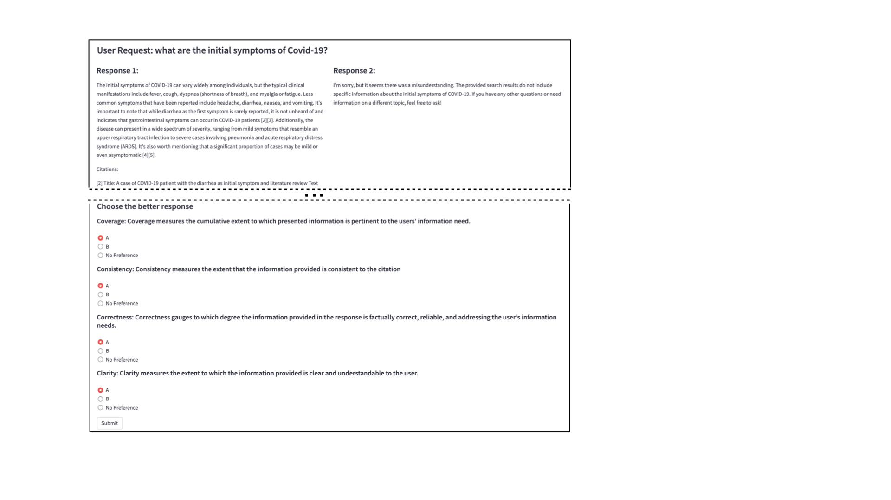

# This part is about evaluating the generated responses

### Sample rids

First, we have an option step to sample rids from the rid mapping, so that we can manually judging responses from requests uniformly distributed across different BIER collections.
Use the following code to do the task:
```bash
python3 sample_rids.py \
    --mapping_file ../dataset/queries/rid_mapping.jsonl \
    --naive_fed_file ../dataset/response_generated/naive_fed/gpt4.jsonl \
    --best_fed_file ../dataset/response_generated/best_fed/gpt4.jsonl \
    --output_file sample_rids.txt
```


### Interface for human judging

Below is an interface for human judging, this requires the sample_rids.txt file to be created first.

```bash
pip3 install streamlit

streamlit run app.py \
    --rid_file sample_rids.txt \
    --naive_fed_file ../dataset/response_generated/naive_fed/gpt4.jsonl \
    --best_fed_file ../dataset/response_generated/best_fed/gpt4.jsonl
    --output_file selections.jsonl
```
Running the code above will create a web interface, like below:



### Plot creation

the code below will create plot that's also exist in paper about the judgement.
```
plot_creating.py
```